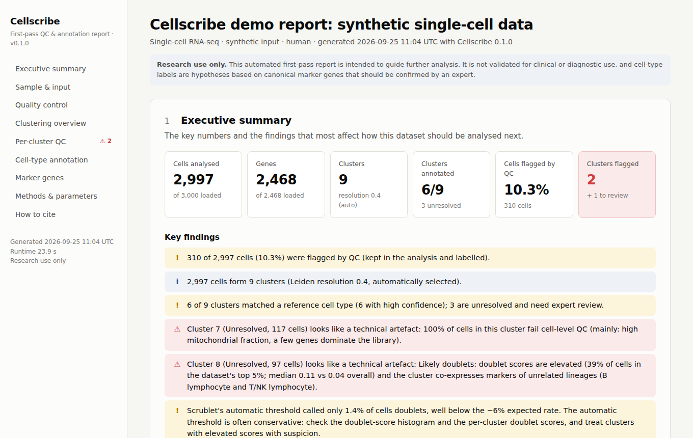
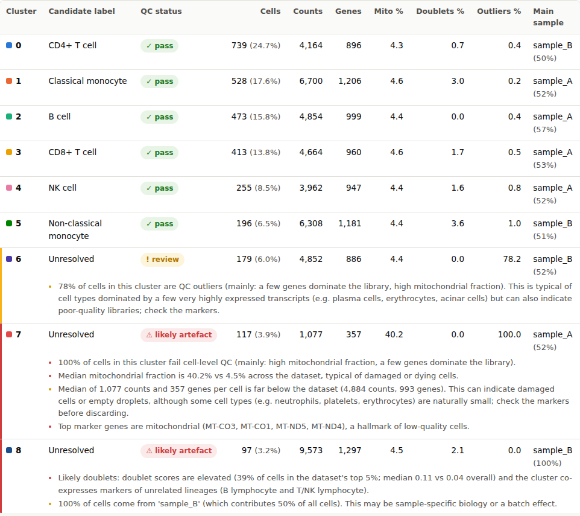
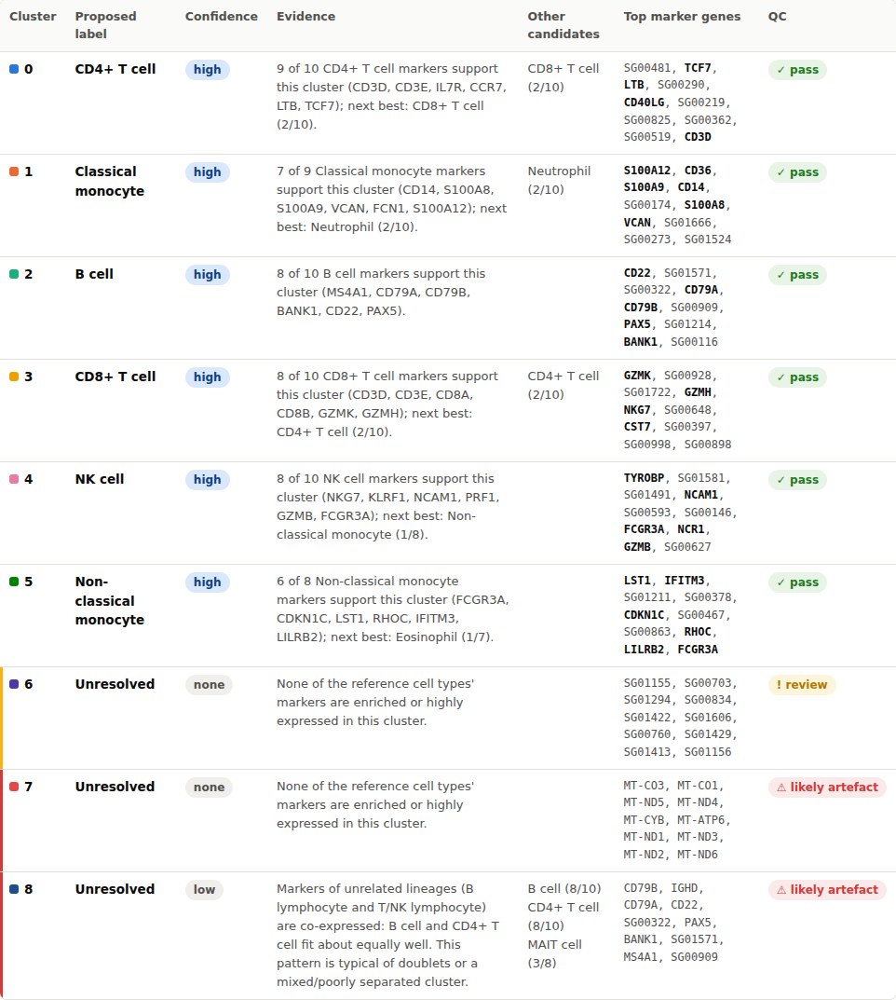
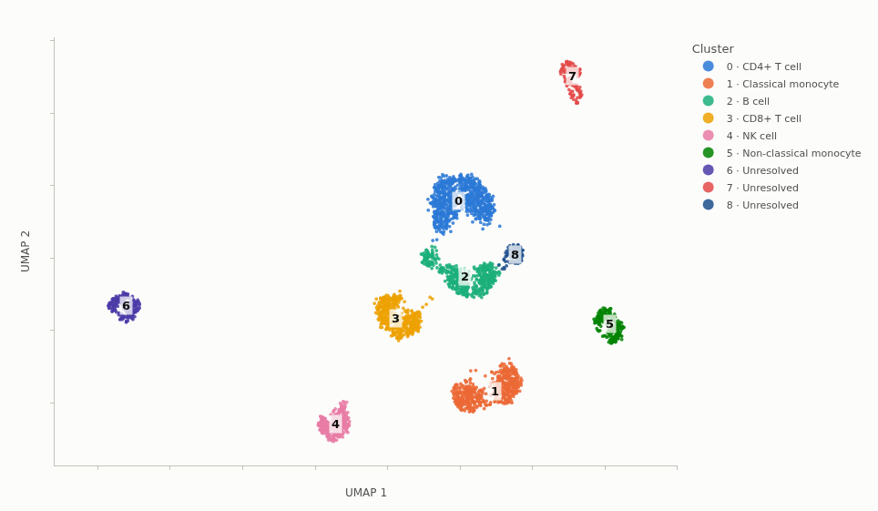
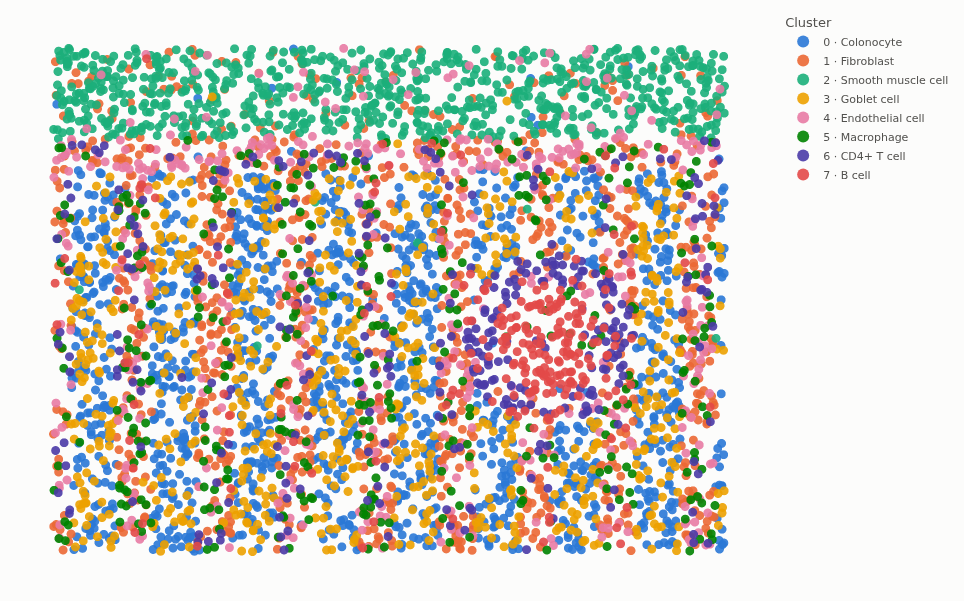

# Cellscribe

**Automated first-pass quality control, clustering, and cell-type annotation reports for single-cell and spatial transcriptomics.**

[](https://github.com/jonahnki/cellscribe/actions/workflows/tests.yml)
[](LICENSE)


Cellscribe turns a counts matrix from a sequencing core into a single, self-contained HTML report: quality control with data-adaptive thresholds, clustering, a **per-cluster QC breakdown** that exposes clusters made of damaged cells or doublets, marker genes, evidence-based cell-type candidates, and (for Visium and Xenium data) spatial statistics. Every parameter is recorded, and a methods paragraph with references is generated for you.

It is written for **wet-lab researchers without in-house bioinformatics support** who need a trustworthy first look at their data before deciding what to do next, and for bioinformatics cores that want a consistent, reproducible first-pass report.

> **Research use only.** Cellscribe is not validated for clinical or diagnostic use. Cell-type labels are hypotheses derived from canonical marker genes and should be confirmed by an expert.



---

## Contents

- [Installation](#installation)
- [Quickstart](#quickstart)
- [Supported inputs](#supported-inputs)
- [What the report contains](#what-the-report-contains)
- [Methods](#methods)
- [Configuration](#configuration)
- [Optional AI narrative](#optional-ai-narrative)
- [Python API](#python-api)
- [Limitations](#limitations)
- [How to cite](#how-to-cite)
- [Contributing](#contributing)

## Installation

Cellscribe requires Python 3.10 or newer.

```bash
pip install cellscribe
```

To install the development version directly from GitHub:

```bash
pip install git+https://github.com/jonahnki/cellscribe.git
```

Optional extras: `cellscribe[harmony]` (opt-in batch integration) and `cellscribe[narrative]` (optional AI-written summary; see below). `cellscribe[all]` installs both.

## Quickstart

```bash
pip install cellscribe && cellscribe demo
```

`cellscribe demo` simulates a PBMC-like dataset (with deliberately planted damaged cells, doublets, and an uncharacterised population) and writes `cellscribe_demo_report.html`. Open it in any browser; no internet connection is needed. Spatial demos are available with `cellscribe demo --kind spatial` (imaging-based, Xenium-like) and `cellscribe demo --kind visium`.

On your own data:

```bash
# Cell Ranger output (folder or .h5; the format is detected automatically)
cellscribe run --input sample1/outs/filtered_feature_bc_matrix --output sample1_report.html

# AnnData, with a fixed Leiden resolution and mouse gene names
cellscribe run --input data.h5ad --resolution 0.8 --species mouse --output report.html

# Visium (Space Ranger outs/) and Xenium output folders
cellscribe run --input visium_run/outs --output visium_report.html
cellscribe run --input output-XETG00123__slide1 --output xenium_report.html

# Several samples in one file: opt in to Harmony integration
cellscribe run --input merged.h5ad --batch-key sample --integrate harmony
```

Useful options: `--config config.yaml`, `--qc-mode filter` (remove flagged cells instead of labelling them), `--markers my_markers.csv` (your own marker reference), `--save-h5ad processed.h5ad` (continue the analysis in scanpy), `--summary-json summary.json` (machine-readable results), `--no-narrative`. Run `cellscribe run --help` for the full list.

To try the loaders on realistic input folders, `cellscribe example-data ./examples_in` writes the synthetic data as a 10x matrix folder, a 10x `.h5`, a CSV and an `.h5ad` (`--kind spatial` writes a Xenium folder, `--kind visium` a Space Ranger folder).

## Supported inputs

| Format | What to pass | Notes |
|---|---|---|
| 10x Genomics | `filtered_feature_bc_matrix/` (mtx + barcodes + features), its `.h5`, or the Cell Ranger `outs/` / run folder | Cell Ranger 2 (`genes.tsv`, genome subfolders) and 3+ layouts; non-gene-expression features (e.g. antibody capture) are excluded. Raw (unfiltered) matrices are rejected with an explanation. |
| AnnData | `.h5ad` | Raw counts are taken from `layers['counts']` (or `raw_counts`), `.X`, or `.raw`, in that order. Log-normalised or scaled data without raw counts are rejected. Ensembl IDs are swapped for symbols when a symbol column exists. |
| CSV / TSV | `.csv`, `.tsv`, `.txt` (optionally `.gz`) | Genes x cells or cells x genes. Orientation is inferred from the labels (known gene symbols, Ensembl IDs, barcode-like names); if it cannot be inferred, the report says so prominently. Override with `--csv-orientation`. |
| 10x Visium | Space Ranger `outs/` folder | `filtered_feature_bc_matrix(.h5)`, `spatial/tissue_positions(.csv/_list.csv/.parquet)`, `scalefactors_json.json`, and the tissue images if present. Off-tissue spots are excluded. |
| 10x Xenium | Xenium output folder | `cell_feature_matrix.h5` (or mtx folder) and `cells.parquet` / `cells.csv.gz`. Negative-control probes are removed from the gene matrix and summarised per cell. No tissue image is required. |

All formats are normalised into one AnnData layout (raw counts in `.X` and `.layers['counts']`, unique symbols as `var_names`, coordinates in `.obsm['spatial']`) before the shared pipeline runs. Malformed inputs fail with a specific message (for example *"...looks like a 10x matrix folder but is missing: barcodes.tsv[.gz]"*), never with a silently empty result.

## What the report contains

A single HTML file (about 6 MB, fully offline; `--plotlyjs cdn` makes it ~1 MB but needs internet to view). Figures are interactive (zoom, hover, legend filtering, SVG export for figures) and every table can be downloaded as CSV. Sections, in order:

1. **Executive summary**: key numbers and plain-language findings, ordered by how much they should change your next steps.
2. **Sample & input**: what was loaded and how it was interpreted (format, species, batches, loader notes).
3. **Quality control**: suggested thresholds per metric (and per batch), reasons cells were flagged, distributions with thresholds, library size vs detected genes, doublet scores.
4. **Clustering overview**: UMAP by cluster, UMAP coloured by QC metrics, sample composition of clusters, and the resolution-selection table.
5. **Per-cluster QC**: the section most first-pass reports lack. Each cluster gets a status (pass, review, likely artefact) with the reasons written out.
6. **Cell-type annotation**: ranked candidates per cluster with confidence, the supporting marker genes, and alternative candidates. Clusters without a confident match are left *unresolved*.
7. **Marker genes**: heatmap and full table of the top markers per cluster.
8. **Spatial analysis** (Visium/Xenium): clusters on the tissue (over the H&E image for Visium), library size and density maps, neighbourhood enrichment, spatially variable genes.
9. **AI narrative summary** (only if you enable it; see below).
10. **Methods & parameters**: a manuscript-style methods paragraph filled in with this run's values, every parameter, software versions, runtimes.
11. **How to cite**: Cellscribe and the methods it builds on.

| Per-cluster QC | Annotation with evidence |
|---|---|
|  |  |

| Clusters (UMAP) | Spatial map (imaging-based data) |
|---|---|
|  |  |

## Methods

The full, parameterised description is generated in each report. In brief:

**Quality control.** Per-cell total counts, detected genes, % mitochondrial, % ribosomal-protein, % haemoglobin, and % of counts in the top 20 genes are computed with scanpy. Outliers are defined with the median absolute deviation (MAD, scaled to be consistent with the standard deviation) instead of fixed universal cutoffs, following scater's `isOutlier` and current best-practice recommendations (McCarthy et al. 2017; Germain et al. 2020; Heumos et al. 2023): cells more than 5 MADs from the median of log counts or log genes, more than 5 MADs above the median top-20 percentage, or more than 3 MADs above the median mitochondrial percentage are flagged. Thresholds are computed per batch when several samples are present. A metric with no variation (for example, no mitochondrial genes on a targeted panel) is skipped and reported rather than applied. Only barcodes with almost no detected genes (fewer than 200 for whole-transcriptome single-cell data, 100 for Visium spots, and 3 to 10 depending on panel size for targeted panels) and genes detected in fewer than 3 cells are removed outright. By default flagged cells are **kept and labelled** (`--qc-mode flag`), so that populations of low-quality cells remain visible as clusters; `--qc-mode filter` removes them before clustering.

**Doublets.** Scrublet (Wolock et al. 2019), as implemented in `scanpy.pp.scrublet`, is run per batch on dissociated single-cell data. It is skipped for Visium (spots contain several cells by design) and imaging-based data. When Scrublet's automatic threshold calls far fewer doublets than expected, the report says so.

**Per-cluster QC.** After clustering, each cluster is checked for: a majority of QC-outlier cells (a *likely artefact* when driven by damage signals such as mitochondrial fraction or tiny libraries; *review* when driven by low complexity, which is also typical of plasma cells or erythrocytes); a median mitochondrial fraction or library size far from the dataset; elevated doublet scores, escalated to *likely doublets* when the cluster also co-expresses markers of unrelated lineages; top markers dominated by mitochondrial, ribosomal-protein, or dissociation-stress genes (van den Brink et al. 2017); very few specific markers; and domination by a single sample.

**Preprocessing and clustering.** Total-count normalisation (10,000 per cell) and log1p; 2,000 highly variable genes (Seurat dispersion method, batch-aware; all genes for small panels); scaling; PCA (ARPACK). Optional Harmony integration (Korsunsky et al. 2019) is applied only when requested. A 15-nearest-neighbour graph on 30 PCs is clustered with Leiden (Traag et al. 2019). **Resolution is selected automatically** from a grid (0.4 to 1.2) by maximising stability x (silhouette + 1) / 2, where stability is the mean adjusted Rand index between Leiden runs with different seeds and silhouette is measured in the PCA space used for the graph. The sweep is shown in the report, and `--resolution` overrides it. UMAP (McInnes et al. 2018) is used for visualisation. All random steps are seeded; runs are reproducible.

**Annotation.** Markers are found with a Wilcoxon rank-sum test of each cluster against all other cells (Benjamini-Hochberg corrected). A reference marker *supports* a cluster if it is significantly up-regulated (adjusted p < 0.05, log2FC >= 1, detected in >= 10% of the cluster) or enriched relative to other clusters (a criterion that keeps lineage markers shared by sibling clusters, such as CD3E in both CD4+ and CD8+ T cells). For each reference cell type with k of its n markers supporting a cluster, the score is (k/n) x min(1, k/3), and over-representation is tested with a hypergeometric test (BH-adjusted across all tests). Labels are assigned only at **high** (score >= 0.5, k >= 3, adj. p < 0.01) or **medium** (score >= 0.3, k >= 2, adj. p < 0.05) confidence. Near-ties between subtypes of one lineage produce a lineage-level label; near-ties across lineages leave the cluster **unresolved** (for Visium, where spots mix cells, they are reported as a *mixture*). Proliferation and interferon-response signatures are reported as cell *states* alongside the type. For homogeneous samples (e.g. sorted cells) with no cluster-specific contrast, a fallback scores highly expressed genes and assigns a type only when it is a clear winner (score >= 0.5 with >= 3 markers, and >= 0.25 above every other type), capped at medium confidence and marked as expression-based. If no resolution gives reproducible, positively separated clusters, the data are reported as a single population rather than split into noise-driven clusters.

**Marker reference.** A bundled, hand-curated set of canonical markers for 75 human and mouse cell types across immune, epithelial, stromal, vascular, neural, muscle, and other lineages, plus 2 cell states ([`cellscribe/data/markers/canonical_markers.yaml`](cellscribe/data/markers/canonical_markers.yaml)). It was compiled from canonical markers established in the primary literature and public atlases; larger community databases (e.g. PanglaoDB, CellMarker) are **not** bundled because their redistribution terms are unclear. You can supply any reference with `--markers` (YAML in the bundled schema, or CSV with `cell_type,gene[,species,lineage]`).

**Spatial statistics** (Squidpy; Palla et al. 2022). Neighbour graph: hexagonal grid adjacency for Visium; Delaunay triangulation for segmented cells, with long edges pruned (falling back to a 6-nearest-neighbour graph if triangulation fails). Neighbourhood enrichment z-scores from 1,000 label permutations. Moran's I (Moran 1950) for the 200 most variable genes with analytic p-values and BH correction.

## Configuration

Every parameter can be set in a YAML file. `cellscribe config > config.yaml` writes all defaults; keep only what you want to change:

```yaml
qc:
  nmads: 4            # stricter outlier threshold
  max_pct_mt: 20      # optional hard ceiling, applied in addition to MADs
clustering:
  resolution_grid: [0.3, 0.5, 0.8, 1.2]
annotation:
  marker_file: my_markers.yaml
```

```bash
cellscribe run --input data.h5ad --config config.yaml
```

Command-line options override the file. Unknown keys and invalid values are rejected with a precise message, so a typo cannot silently change an analysis. An annotated example is in [`examples/config.yaml`](examples/config.yaml).

## Optional AI narrative

If, and only if, the environment variable `ANTHROPIC_API_KEY` is set and the `anthropic` package is installed (`pip install "cellscribe[narrative]"`), Cellscribe asks Claude (Anthropic) to write a two-to-three paragraph plain-English interpretation: what the data look like, what to be cautious about, and suggested next steps. It appears as its own clearly labelled section.

- **Nothing changes without it.** With no key the report is identical apart from that one section; every analysis is performed locally.
- **Only summary statistics are sent**: cell counts, QC thresholds and flags, cluster sizes, candidate labels and confidence, marker gene *names*, and spatial summary statistics. No expression values, no per-cell data, and no cell barcodes leave your machine. The exact payload is built by `cellscribe.narrative.build_payload` and can be inspected.
- `--no-narrative` (or `narrative.enabled: false`) disables it even when a key is set.
- AI-generated text can be wrong; the report says so and every statement should be checked against the sections above it.

## Python API

```python
import cellscribe

result = cellscribe.run("sample1/outs/filtered_feature_bc_matrix", output="report.html")

result.adata                 # processed AnnData (clusters in obs['cellscribe_cluster'], labels in obs['cellscribe_annotation'])
result.summary               # JSON-serialisable summary of every stage
result.qc.cluster_table      # per-cluster QC table (pandas)
[c.label for c in result.annotation.clusters]

# configure programmatically
cfg = cellscribe.CellscribeConfig().with_overrides({"clustering.resolution": 0.8, "qc.mode": "filter"})
result = cellscribe.run(adata, output="report.html", config=cfg)   # an in-memory AnnData with raw counts also works
```

Individual stages (`cellscribe.loaders`, `cellscribe.qc`, `cellscribe.preprocessing`, `cellscribe.clustering`, `cellscribe.annotation`, `cellscribe.spatial`, `cellscribe.report`) can be used on their own.

## Limitations

Cellscribe is a first look, not a finished analysis. In particular:

- Automated labels come from canonical markers. They can miss rare, activated, or tissue-specific states; clusters marked unresolved need expert review, and even confident labels should be checked.
- MAD-based thresholds adapt to each dataset but assume most cells are of acceptable quality. In a very poor sample the median itself is low quality, which the report flags when many cells fail QC.
- Doublet detection is imperfect: heterotypic doublets whose profile is dominated by one parent can remain within that parent's cluster.
- Resolution selection favours robust, well-separated clusters and may merge closely related subtypes; use `--resolution` to explore finer structure.
- Visium spots contain several cells, so cluster labels describe tissue regions. Cellscribe does not perform deconvolution.
- Batch integration is opt-in. When several samples are present without integration, the report highlights clusters dominated by one sample.
- Performance: in our tests a 30,000-cell dataset took about 2 minutes end to end on 4 CPU cores with a peak memory of about 3 GB; runtime grows roughly linearly with cell number. Interactive scatter plots draw a random subsample above 50,000 cells.

## How to cite

If Cellscribe contributes to your work, please cite it (see [`CITATION.cff`](CITATION.cff); GitHub's "Cite this repository" button uses it) together with the methods listed in the report's *How to cite* section, notably Scanpy (Wolf et al. 2018), Leiden (Traag et al. 2019), Scrublet (Wolock et al. 2019), and Squidpy (Palla et al. 2022) where used.

```bibtex
@software{cellscribe,
  title   = {Cellscribe: automated first-pass quality control, clustering and annotation reports
             for single-cell and spatial transcriptomics},
  author  = {{Cellscribe contributors}},
  year    = {2026},
  version = {0.1.0},
  url     = {https://github.com/jonahnki/cellscribe},
  license = {MIT}
}
```

## Contributing

Contributions are very welcome, whether that's new marker sets (with clear provenance), loaders for other platforms, better QC heuristics, bug reports, or documentation. See [CONTRIBUTING.md](CONTRIBUTING.md) for the development setup and guidelines. If Cellscribe is useful to you, starring the repository helps others find it.

## Acknowledgements

Cellscribe is built on [scanpy](https://scanpy.readthedocs.io), [anndata](https://anndata.readthedocs.io), [squidpy](https://squidpy.readthedocs.io), [leidenalg](https://github.com/vtraag/leidenalg) / [igraph](https://igraph.org), [UMAP](https://umap-learn.readthedocs.io), [Scrublet](https://github.com/swolock/scrublet) (via scanpy), [harmonypy](https://github.com/slowkow/harmonypy), and [Plotly](https://plotly.com/python/). We are grateful to their authors.

## License

MIT; see [LICENSE](LICENSE).
